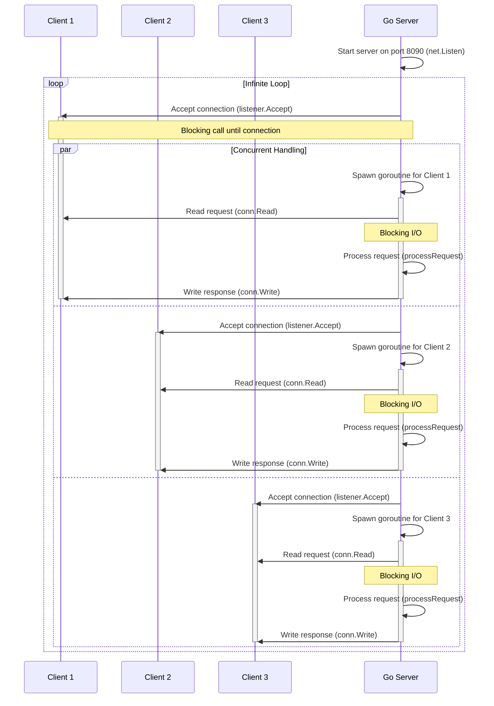

# Simple HTTP server

## Introduction
This is a simple implementation of an HTTP server. The server listens on a specified port, accepts incoming TCP connections, reads HTTP requests from clients, and responds with a basic "Hello, World!" message.

The server is designed to handle multiple connections concurrently using Go's goroutines, making it a basic example of a ***multi-threaded server***.

---

## Key Concepts
### Server Creation
The server is initialized using the `net.Listen` function, which starts a TCP listener on a specified port (8090 in this case)

### Connection Handling Loop
Once the server is running, it enters an infinite loop (`for {}`) where it continuously waits for incoming connections. This is managed by the `listener.Accept` method, which is a blocking call. This means that the server will pause and wait until a client establishes a connection. Once a connection is made, the server proceeds to handle that connection.

### Blocking I/O Operations
The server uses blocking I/O operations for both reading from and writing to the connection.
* `conn.Read` method reads the incoming request data into a buffer
* `conn.Write` method sends the response back to the client

### Concurrency with Goroutines
Each incoming connection is handled in a separate goroutine. This allows the server to process multiple connections simultaneously without blocking the main loop.

For example, when a client connects to the server, the `handleConnection` function is called within a new goroutine. This enables the server to accept and handle other incoming connections while still processing the current one.

---

## Flow Diagram

---

## Improvements
The Basic Implementation has a few issues:

1. Panic: The original implementation uses `log.Panicf` to handle errors, which can crash the entire server if a single connection fails. Replace `log.Panicf` with `log.Printf` to log errors and continue running the server.
2. Request Timeout Handling: The server doesn't handle timeouts for requests. We can use `SetReadDeadline` to set a timeout for the request. If the client doesn't send a request within the timeout period, the server will close the connection.
3. Handling Large Requests: The server reads up to 1024 bytes into a buffer for each request, but it doesn’t account for cases where requests are larger than this buffer, leading to potential truncation of the request. We use `bufio.NewReader` to read the entire request.
4. Graceful Shutdown: The server doesn't handle graceful shutdowns.  A graceful shutdown ensures that the server can complete all ongoing connections and clean up resources before shutting down. 
