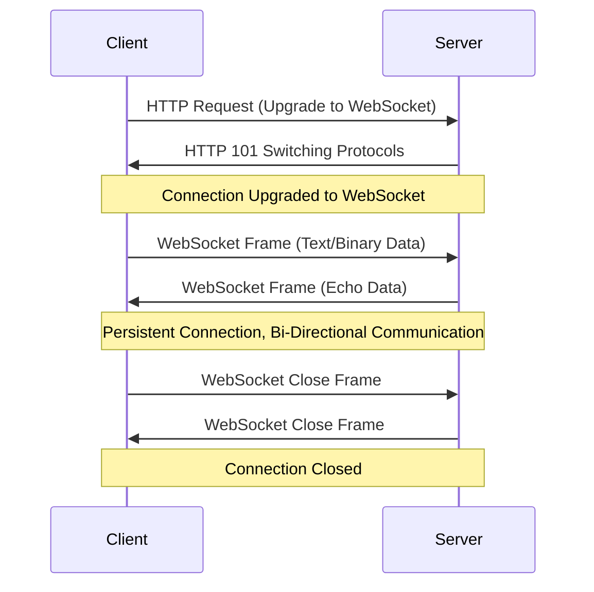

## Websockets

WebSockets are a protocol that enables interactive communication sessions between a user's browser and a server. Once a WebSocket connection is established, the client and server can send messages to each other at any time, making it ideal for real-time applications like chat apps, live notifications, or multiplayer games.

### Key Concepts in WebSockets

1. **HTTP Handshake (Connection Upgrade):**
   - The WebSocket connection begins with an HTTP handshake. The client sends an HTTP request to the server asking to upgrade the connection to a WebSocket.
   - If the server supports WebSockets, it responds with an ***HTTP 101*** status code, indicating that the connection is being upgraded.
   - This upgrade is crucial because it transforms the HTTP connection into a WebSocket connection, enabling full-duplex communication.

2. **Persistent Connection:**
   - Unlike HTTP, which typically opens and closes connections for each request/response cycle, WebSockets maintain a single open connection for the entire session.
   - This connection allows both the client and server to send messages to each other at any time without re-establishing a connection.

3. **Bi-Directional Communication:**
   - After the connection is established, either party can send data to the other. This is a departure from the typical client-server model where the client makes requests and the server responds.

4. **Message Framing:**
   - Data sent over a WebSocket connection is transmitted in the form of frames. These frames can be text, binary, or control frames (like ping/pong or close frames).
   - The frames are typically smaller chunks of a larger message, allowing for more efficient communication.

5. **Handling Disconnections:**
   - WebSocket connections can be closed by either the client or the server by sending a close frame. Proper handling of connection closures and errors is essential to maintain the stability of the application.

### Detailed Walkthrough:

1. **HTTP Handshake (Connection Upgrade):**
   - The function `upgrader.Upgrade(w, r, nil)` is where the HTTP handshake happens. The client sends an HTTP request, and this code upgrades that request to a WebSocket connection.

2. **Persistent Connection:**
   - Once the connection is upgraded, it stays open. The loop inside `handleWebSocket` continually reads and writes messages using `conn.ReadMessage()` and `conn.WriteMessage()`. This is different from HTTP, where each request and response cycle would require a new connection.

3. **Bi-Directional Communication:**
   - Inside the loop, `ReadMessage` reads messages from the client, and `WriteMessage` sends messages back to the client. Both can happen at any time, and this is what enables real-time communication.

4. **Handling Disconnections:**
   - The `defer conn.Close()` ensures that the connection is properly closed when the function exits, either due to an error or the client closing the connection.

### WebSocket Communication Flow - Mermaid Diagram

Here’s a mermaid diagram to illustrate the WebSocket communication flow:

### Keypoints
- **Efficiency:** WebSockets reduce the overhead associated with establishing and tearing down HTTP connections by maintaining a persistent connection.

- **Flexibility:** The protocol allows for sending different types of data (text, binary) and control frames (ping/pong, close).

- **Scalability:** WebSockets can handle thousands of connections concurrently, making them suitable for high-traffic applications.
